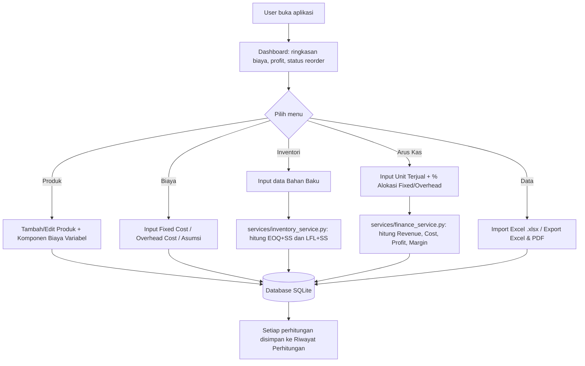
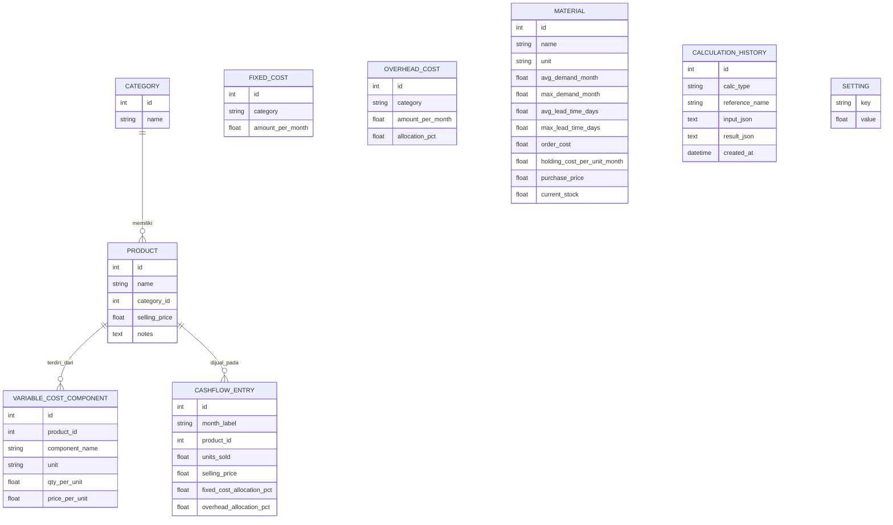

# UMKM Inventori & Finansial - Web App

Aplikasi web yang menggantikan file Excel `Sheet_Inventori_dan_Finansial_UMKM.xlsx`.
Seluruh rumus pada spreadsheet dikonversi menjadi fungsi Python di `services/`,
sehingga user tidak pernah melihat atau mengedit rumus secara langsung.

## Status pengujian (baca ini dulu)

Saya (Claude) sudah menjalankan pengujian otomatis berikut di sandbox saya sendiri,
**bukan di komputer/server Anda**, jadi verifikasi ulang tetap disarankan:

- Semua route utama diakses dengan Flask test client -> semua mengembalikan HTTP 200.
- Alur tambah/hapus data (produk, kategori, komponen biaya, bahan baku, arus kas)
  diuji lewat form POST dengan CSRF token asli -> berhasil.
- File `Sheet_Inventori_dan_Finansial_UMKM.xlsx` yang Anda unggah, diimpor lewat
  fitur Import Excel -> berhasil masuk ke database.
- Hasil perhitungan Python dibandingkan manual dengan nilai pada spreadsheet asli
  (bukan dihitung ulang oleh Excel di sandbox saya, tapi dibandingkan dengan nilai
  yang sudah tersimpan di file .xlsx-nya):
  - Total Fixed Cost: 600.000 (cocok)
  - Total Overhead Teralokasi: 610.000 (cocok)
  - EOQ/Safety Stock/ROP untuk 3 bahan baku contoh: cocok persis
  - Status reorder EOQ & LFL: cocok persis
  - Total Revenue 24.680.000, Total Profit 15.250.500, Margin rata-rata 61,79%: cocok
- Export ke Excel (.xlsx) dan PDF diuji -> file berhasil dibuat tanpa error.

Yang **belum** saya uji dan sebaiknya Anda cek sendiri sebelum dianggap production-ready:
- Perilaku di browser sungguhan (mobile Android/iPhone/tablet) -- saya hanya menguji
  lewat HTTP request, bukan rendering visual asli.
- Keamanan tingkat lanjut (penetration testing, rate limiting, dsb) tidak diuji.
- Sheet **'Inventori Mingguan'** (tabel MRP mingguan 12 minggu, model POQ) **tidak**
  dikonversi menjadi fitur di aplikasi ini. Sheet itu berisi satu skenario contoh yang
  berdiri sendiri (bukan terhubung ke master data bahan baku), sehingga sulit dibuat
  dinamis tanpa desain ulang. Dashboard di aplikasi web ini menghitung status reorder
  dari data Material di database (sheet 'Inventori Harian'), bukan dari sheet
  'Inventori Mingguan' seperti pada Dashboard Excel aslinya. Lihat komentar di
  `services/dashboard_service.py` untuk detail teknisnya.
- Upgrade ke PostgreSQL/MySQL disiapkan strukturnya (lihat `config.py`) tapi belum
  benar-benar dicoba tersambung ke database tersebut.

## Struktur Folder

```
project/
├── app.py                 # Entry point, application factory
├── config.py               # Konfigurasi (SQLite -> mudah upgrade ke Postgres/MySQL)
├── forms.py                 # WTForms: validasi input + CSRF, semua label Bahasa Indonesia
├── seed_data.py              # Skrip opsional isi data contoh (sama seperti dummy data Excel)
├── requirements.txt
├── models/                  # Definisi tabel database (SQLAlchemy)
│   ├── product.py            # Category, Product, VariableCostComponent
│   ├── cost.py                 # FixedCost, OverheadCost, Setting (Asumsi)
│   ├── inventory.py             # Material (bahan baku)
│   ├── cashflow.py                # CashFlowEntry
│   └── history.py                  # CalculationHistory (riwayat perhitungan)
├── services/                # MESIN PERHITUNGAN (konversi rumus Excel -> Python)
│   ├── cost_service.py        # Sheet 'Biaya Tetap' & 'Biaya Tidak Langsung'
│   ├── inventory_service.py    # Sheet 'Inventori Harian' (EOQ+SS, LFL+SS)
│   ├── finance_service.py       # Sheet 'Arus Kas'
│   └── dashboard_service.py      # Sheet 'Visualisasi'
├── routes/                  # Controller (Flask Blueprints) - pola MVC
│   ├── dashboard.py, products.py, costs.py, inventory.py, cashflow.py,
│   └── data_io.py (import/export), history.py
├── templates/                # View (Jinja2 + Bootstrap 5)
├── static/css, static/js
├── utils/                    # formatters.py (Rupiah, persen), validators.py
├── uploads/                   # File Excel yang diupload user (sementara)
├── exports/                    # File hasil export (Excel/PDF)
└── database/                    # File app.db (SQLite) dibuat otomatis saat pertama jalan
```

Ini mendekati pola **MVC**: `models/` = Model, `templates/` = View,
`routes/` = Controller, dan `services/` sebagai lapisan business logic terpisah
supaya controller tetap tipis dan logika rumus mudah diuji/dipelihara sendiri.

## Cara Menjalankan (Development)

```bash
cd project
python3 -m venv venv
source venv/bin/activate        # Windows: venv\Scripts\activate
pip install -r requirements.txt

# (opsional) isi data contoh, sama seperti dummy data di Excel
python seed_data.py

python app.py
```

Buka `http://localhost:5000` di browser. Database SQLite (`database/app.db`)
dan folder `uploads/`, `exports/` dibuat otomatis saat pertama kali dijalankan.

## Cara Deployment (garis besar, belum saya coba langsung)

Untuk production, jangan pakai `python app.py` (server debug Flask). Contoh dengan
Gunicorn (sudah ada di `requirements.txt`), di belakang Nginx sebagai reverse proxy:

```bash
export FLASK_ENV=production
export SECRET_KEY="ganti-dengan-random-string-yang-kuat"
gunicorn -w 4 -b 0.0.0.0:8000 "app:app"
```

Untuk pindah dari SQLite ke PostgreSQL/MySQL, set environment variable `DATABASE_URL`
sebelum menjalankan aplikasi (lihat komentar di `config.py`), lalu install driver
yang sesuai (`pip install psycopg2-binary` untuk Postgres, atau `pip install pymysql`
untuk MySQL). Tidak ada perubahan kode lain yang dibutuhkan karena model ditulis
dengan SQLAlchemy (database-agnostic) -- namun ini klaim berdasarkan desain, saya
belum menguji koneksi ke Postgres/MySQL sungguhan.

## Alur Sistem (Flowchart, teks Mermaid)

Kode di bawah bisa ditempel ke https://mermaid.live untuk dilihat sebagai diagram,
atau langsung terbaca sebagai deskripsi alur:



## Entity Relationship Diagram (ERD, teks Mermaid)



`FIXED_COST`, `OVERHEAD_COST`, `MATERIAL`, `CALCULATION_HISTORY`, dan `SETTING`
tidak punya foreign key ke tabel lain (berdiri sendiri), jadi tidak digambar
dengan garis relasi di atas.

## Pemetaan Rumus Excel -> Fungsi Python

| Sheet Excel | Sel/Rumus | Fungsi Python |
|---|---|---|
| Biaya Tetap | `C7=SUM(C3:C6)` | `services/cost_service.py: total_fixed_cost()` |
| Biaya Tidak Langsung | `E=C*D`, `E7=SUM(E3:E6)` | `total_overhead_cost()`, `overhead_breakdown()` |
| Biaya Variabel | `G=E*F`, `J=SUMIF(...)` | `models/product.py: Product.total_variable_cost_per_unit` |
| Inventori Harian | `L..V` (EOQ, Safety Stock, ROP, LFL) | `services/inventory_service.py: calculate_material_inventory()` |
| Arus Kas | `E..N` (Revenue, Cost, Profit, Margin) | `services/finance_service.py: calculate_cashflow_entry()` |
| Visualisasi | `C6, C7, C8, C12-C16, C19-C20` | `services/dashboard_service.py: dashboard_summary()` |

Setiap fungsi di atas diberi komentar yang merujuk ke sel Excel aslinya supaya
mudah diverifikasi ulang jika rumus di spreadsheet berubah di kemudian hari.

## Keamanan yang Sudah Diterapkan

- CSRF protection di semua form (Flask-WTF, `CSRFProtect`).
- Validasi input server-side (WTForms validators: `DataRequired`, `NumberRange`, dll).
- Query database memakai SQLAlchemy ORM (parameterized), bukan string SQL manual,
  sehingga terlindung dari SQL Injection standar.
- Nama file upload disaring lewat `utils/validators.py: safe_join_upload()` untuk
  mencegah path traversal, dan ekstensi dibatasi hanya `.xlsx`.
- Output template memakai Jinja2 auto-escaping (default Flask) untuk mencegah XSS dasar.
- `MAX_CONTENT_LENGTH` dibatasi 10MB untuk mencegah upload file raksasa.

Yang **belum** diterapkan dan disarankan ditambah sebelum produksi sungguhan:
rate limiting, autentikasi/login multi-user, logging terstruktur, backup database
otomatis, dan HTTPS (biasanya diatur di level Nginx/reverse proxy, bukan di kode Flask).

## Menambah Produk/Bahan Baku/Rumus Baru di Masa Depan

- Produk & bahan baku baru: cukup lewat form di web (menu Produk / Inventori),
  otomatis tersimpan di database dan langsung ikut terhitung di semua perhitungan
  (Dashboard, Cash Flow, dst) tanpa mengubah kode.
- Rumus baru: tambahkan fungsi baru di file `services/*.py` yang sesuai kategorinya,
  lalu panggil dari `routes/*.py`. Struktur ini sengaja dipisah per kategori
  (`cost.py`, `inventory.py`, `finance.py`) supaya tidak perlu menyentuh file lain.
